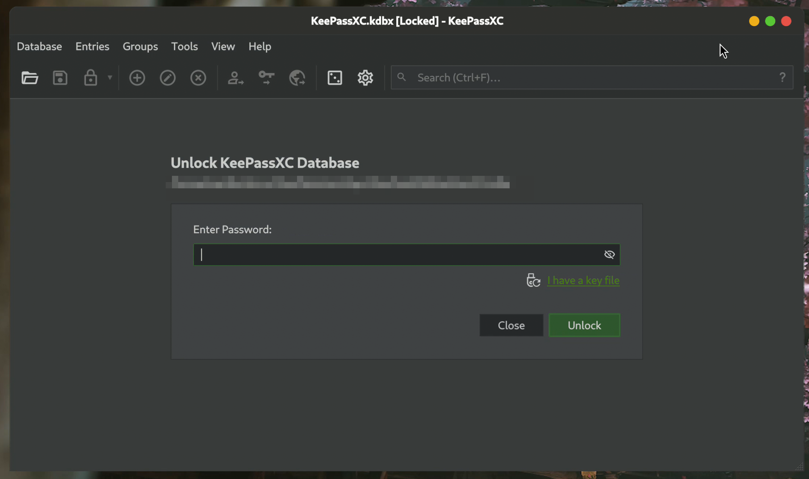

# QWhiteSurGtkDecorations
Qt decoration plugin implementing WhiteSurGTK-like client-side decorations.

This project is modified based on the [QAdwaitaDecorations](https://github.com/FedoraQt/QAdwaitaDecorations) project.  

Some of the icon resources used in this project come from [WhiteSur-gtk-theme](https://github.com/vinceliuice/WhiteSur-gtk-theme.git).

## Screenshots
After applying the plugin, the title bar of the Qt application looks like this:


## How to compile
This library uses private Qt headers and will likely not be forward nor
backward compatible. This library will have to be recompiled with every
Qt update. While it can be build using Qt 5, it is recommended to get
backported changes from Qt 6. You can get these [here](https://src.fedoraproject.org/rpms/qt5-qtwayland/blob/rawhide/f/qtwayland-decoration-support-backports-from-qt6.patch).

Build instructions:

```
mkdir build
cd build
cmake [OPTIONS] [-DUSE_QT6=true] [-HAS_QT6_SUPPORT] ..
make && make install
```

## For Archlinux users
Archlinux users can install qwhitesurgtkdecorations with aur:
```shell
yay -S qwhitesurgtkdecorations-qt5 qwhitesurgtkdecorations-qt6
```

## Usage
It can be used by setting the QT_WAYLAND_DECORATION environment variable:

```
export QT_WAYLAND_DECORATION=whitesur-gtk
```

## For flatpak apps
To enable Qt applications running via flatpak to also use QWhiteSurGtkDecorations, you first need to obtain the Qt application's runtime using the following command, taking the application org.keepassxc.KeePassXC as an example:
```shell
[user@hostname~]% flatpak info  org.keepassxc.KeePassXC

KeePassXC - Secure and Full-featured Password Manager

          ID: org.keepassxc.KeePassXC
         Ref: app/org.keepassxc.KeePassXC/x86_64/stable
        Arch: x86_64
      Branch: stable
     Version: 2.7.11
     License: GPL-3.0-or-later
      Origin: flathub
  Collection: org.flathub.Stable
Installation: system
   Installed: 50.6 MB
     Runtime: org.kde.Platform/x86_64/5.15-25.08
         Sdk: org.kde.Sdk/x86_64/5.15-25.08

      Commit: ccbae381eaacb63503f02810a516525a3d4c0f12669840c3744e59866b535fd0
      Parent: f6172470ce4c0e1de08393988f0f164184ba34404f65d81c3d299eba40ff2977
     Subject: Bump to 2.7.11 release (b2ac9f9e1947)
        Date: 2025-11-24 15:02:30 +0000
```
As shown above, the flatpak runtime for this application is `org.kde.Platform/x86_64/5.15-25.08`, so `QWhiteSurGtkDecorations-5.15-25.08.flatpak` needs to be installed.:

```shell
sudo flatpak install QWhiteSurGtkDecorations-5.15-25.08.flatpak
# or
# flatpak install --user QWhiteSurGtkDecorations-5.15-25.08.flatpak
```

## License
The code is under [LGPL 2.1](https://www.gnu.org/licenses/old-licenses/lgpl-2.1.en.html) with the "or any later version" clause.

